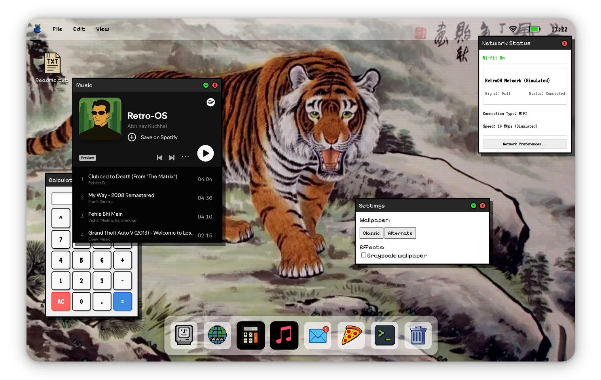
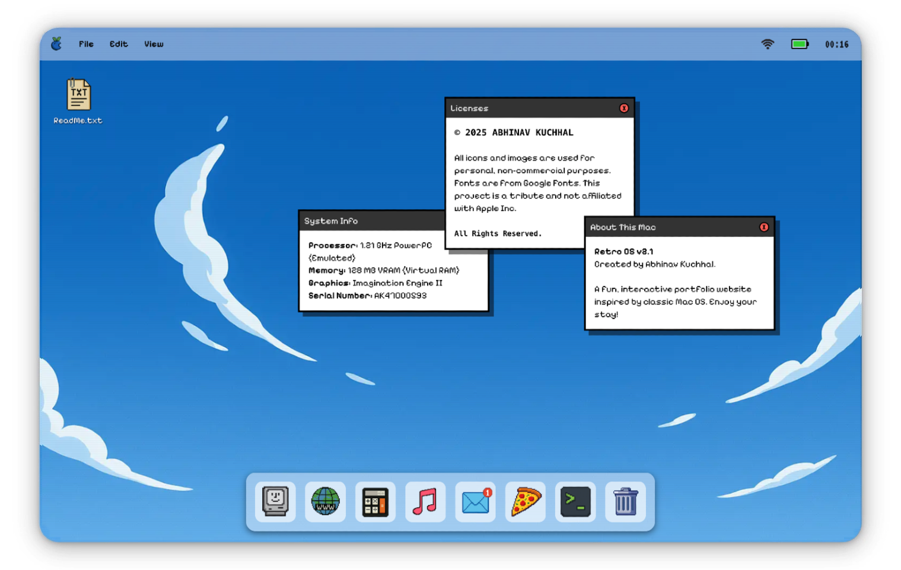
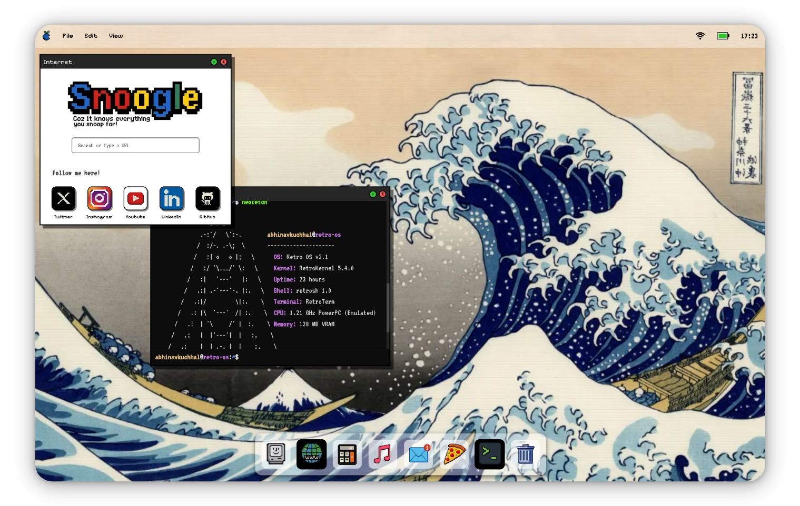

# RetroOS 🖥️

### Where nostalgia meets modern web development.

RetroOS is a nostalgic, interactive portfolio environment that recreates the magic of a vintage 90s operating system. Built with **Vanilla JavaScript, HTML5, and CSS3**, it serves as a creative workspace to showcase projects, lore, and software engineering expertise.

---

## 🌟 The Vision

The goal of RetroOS is to provide a fully immersive "OS-in-a-browser" experience. From the boot sequence to the draggable windows and folder navigation, every detail is crafted to evoke memories of classic Macintosh systems while remaining a powerful platform for modern portfolio content.

### ✨ Key Features
- **Functional Window Manager**: Minimize, maximize, and drag retro windows across the desktop.
- **Classic Apps**: Built-in Calculator, Terminal, Music Player (with Spotify integration), and a dedicated Mail app.
- **Persistence Layer**: Custom guestbook and notice board powered by **Upstash Redis**.
- **Dynamic Themes**: Change wallpapers or flip the switch to "Classic Mode" for that authentic grayscale vintage aesthetic.
- **Interactive Lore**: Discover hidden files, "System Architecture Blueprints," and Easter eggs tucked away in the Finder.

---

## 🤝 Open For Contributions!

RetroOS is a playground for retro computing fans and web developers alike. We are looking for contributors to help grow this digital time capsule!

### How You Can Help:
- **New Apps**: Build a "Notes" app, a "Painting" app, or more OS utilities.
- **UI Enhancements**: Help us refine the retro aesthetics and animations.
- **Easter Eggs**: Add more hidden lore and secrets for users to find or "sacrifice."
- **Performance**: Optimize the pure vanilla JS window management system.

**Check out our [Issues](https://github.com/JustPratiyush/RetroOS/issues) to get started!**

---

## 🛠 Tech Stack

- **Frontend**: Vanilla HTML/CSS/JS (Zero framework overhead for that raw performance).
- **Icons & Graphics**: Curated pixel-art and retro Macintosh-style assets.
- **Backend & Persistence**: Vercel Serverless Functions + Upstash Redis.
- **Typography**: `Pixelify Sans` for the modern-pixel look and `VT323` for classic numerical data.

---

## 📸 Screenshots

---

## 📄 License & Credits

© 2025 **Abhinav Kuchhal**. All rights reserved.
Inspired by classic operating systems. This project is a creative tribute and is not affiliated with Apple Inc.

---

## 👨‍💻 Contact & Socials

- **Portfolio**: [abhinavkuchhal.com](https://abhinavkuchhal.com)
- **GitHub**: [@JustPratiyush](https://github.com/JustPratiyush)
- **X (Twitter)**: [@JustPratiyush](https://x.com/JustPratiyush)
- **Instagram**: [@abhinavkuchhal7](https://www.instagram.com/abhinavkuchhal7/)

---

*“Explore the past, build the future.”* 💾